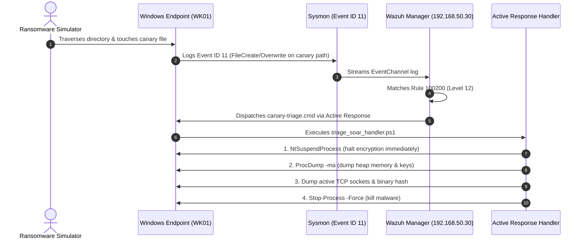
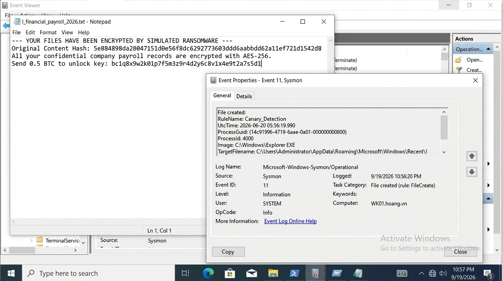
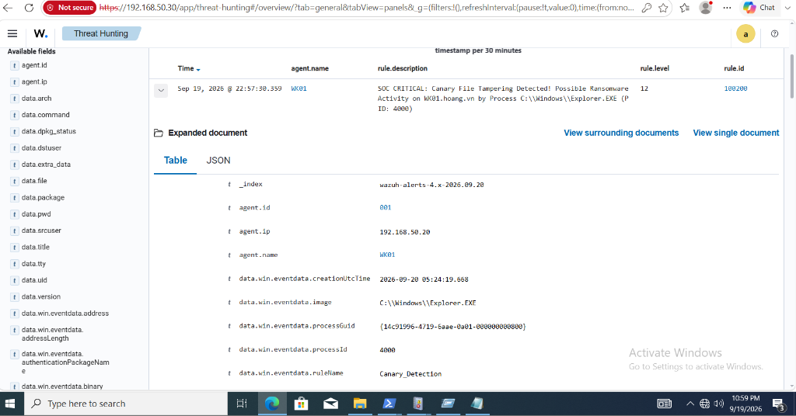
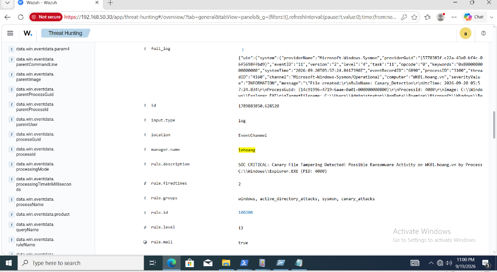
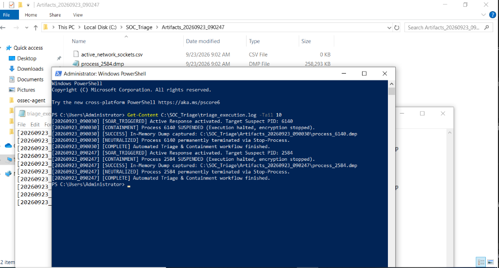
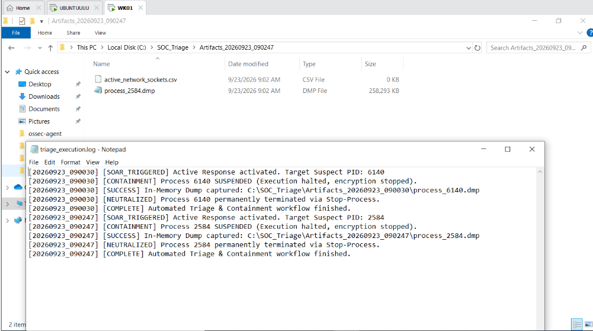

# Automated Ransomware Canary Defense & In-Memory SOAR Triage

A detection engineering and incident response lab exploring proactive ransomware detection using decoy canary files and automated volatile memory collection via Wazuh Active Response.

---

## 1. Concept & Problem Statement

In practical incident response, detecting ransomware only after the ransom note appears on screen is usually too late:
1. Symmetric encryption keys (AES-256 / ChaCha20) in heap memory are purged via `ZeroMemory` or process termination.
2. Shadow copies and backups may already be deleted.
3. Offline recovery without paying a ransom becomes impossible.

This lab explores a **canary-based detection strategy**: placing high-priority decoy files in directories most likely to be indexed first during recursive traversal (e.g., alphabetically sorted names like `!_financial_payroll_2026.txt`). Tampering with a decoy file triggers immediate alerting, process suspension, memory acquisition via ProcDump, and final termination.

---

## 2. Lab Setup & Telemetry Flow

The lab was validated on VMware Workstation across two primary nodes:

| Node | Operating System | Hostname | IP Address | Role |
| :--- | :--- | :--- | :--- | :--- |
| **SIEM Server** | Ubuntu 22.04 LTS | `lehoang` | `192.168.50.30` | Wazuh Manager 4.8, rule engine, Active Response dispatch |
| **Endpoint** | Windows 10 Pro | `WK01.hoang.vn` | `192.168.50.20` | Monitored host, canary files, Sysmon v14, Wazuh Agent 4.8 |



---

## 3. Detection Engineering Configuration

### Sysmon Filter (`sysmon/sysmon_canary_config.xml`)
Captures file modifications against designated canary naming patterns using Sysmon Event 11:

```xml
<Sysmon schemaversion="4.90">
  <EventFiltering>
    <RuleGroup name="Canary_Detection" groupRelation="or">
      <FileCreate onmatch="include">
        <TargetFilename condition="contains">_financial_payroll_2026</TargetFilename>
        <TargetFilename condition="contains">_confidential_contract</TargetFilename>
      </FileCreate>
    </RuleGroup>
  </EventFiltering>
</Sysmon>
```

### Wazuh SIEM Rule (`wazuh/local_rules.xml`)
Correlates incoming Sysmon Event 11 events under Rule 100200 (Level 12):

```xml
<group name="windows,active_directory_attacks,sysmon,canary_attacks,">
  <rule id="100200" level="12">
    <if_group>windows</if_group>
    <field name="win.system.eventID">^11$</field>
    <field name="win.eventdata.targetFilename" type="pcre2">(?i)(_financial_payroll_2026|_confidential_contract)</field>
    <description>SOC CRITICAL: Canary File Tampering Detected! Possible Ransomware Activity on $(win.system.computer) by Process $(win.eventdata.image) (PID: $(win.eventdata.processId))</description>
    <mitre>
      <id>T1486</id>
    </mitre>
  </rule>
</group>
```

### Wazuh Active Response Dispatch (`wazuh/ossec.conf.snippet`)
Binds Rule 100200 to dispatch the Windows triage script down port 1514 to the affected endpoint:

```xml
<ossec_config>
  <command>
    <name>canary-memory-triage</name>
    <executable>canary-triage.cmd</executable>
    <timeout_allowed>no</timeout_allowed>
  </command>

  <active-response>
    <command>canary-memory-triage</command>
    <location>all</location>
    <rules_id>100200</rules_id>
  </active-response>
</ossec_config>
```

---

## 4. Engineering Trade-offs & Lessons Learned

Developing this triage pipeline surfaced several practical challenges that highlighted the difference between lab theory and live incident response:

### 1. The Core IR Dilemma: Kill vs Dump (Why Process Suspension is Mandatory)
- **Problem:** If an automated responder merely dumps process memory without stopping execution, ProcDump can take 5 to 15 seconds to write 500MB+ of RAM to disk. During those seconds, the ransomware continues encrypting thousands of additional user files. Conversely, immediately killing the process with `Stop-Process` stops encryption but purges volatile symmetric keys from memory.
- **Solution:** The handler implements a **Suspend -> Dump -> Terminate** lifecycle:
  1. Call `NtSuspendProcess` (via P/Invoke in `triage_soar_handler.ps1`) to instantly freeze all threads of the offending PID.
  2. ProcDump safely captures full memory (`-ma`) from the frozen process.
  3. Active network sockets and file hashes are logged.
  4. Call `Stop-Process -Force` to permanently eliminate the threat.

### 2. Reliable PID Resolution from Wazuh to Windows
- **Challenge:** The batch bridge (`canary-triage.cmd`) invoked by `wazuh-execd` must forward arguments to PowerShell. If PID resolution fails or the process handle was transient, querying `Get-WinEvent` blindly with `-MaxEvents 1` risks grabbing an unrelated file write event from a background service.
- **Fix:** The PowerShell script inspects recent Sysmon Event 11 entries specifically filtering for designated canary filenames, ensuring the extracted PID strictly belongs to the canary tampering event.

### 3. Active Response Scope (`<location>all</location>` vs `<location>local</location>`)
- On Wazuh Manager (`ossec.conf`), setting `<location>local</location>` causes the manager to execute the script locally on Ubuntu Linux (which fails for `.cmd` batch scripts).
- Configuring `<location>all</location>` (or `<location>defined-agent</location>`) routes the command down the agent connection port (1514) to execute on the Windows endpoint where the alert originated.

---

## 5. Lab Evidence & Verification

### Phase 1: Canary Tampering & Sysmon Event 11
Simulated ransomware modified decoy file `!_financial_payroll_2026.txt`. Sysmon Event 11 logged the image and Process ID:


### Phase 2: Wazuh SIEM Alert (Rule 100200)
Wazuh Manager ingested the event channel and fired Rule 100200:


### Phase 3: Telemetry & JSON Forensic Metadata
Full structured JSON payload confirming computer identity (`WK01`) and file path indicators:


### Phase 4: SOAR Memory Dump & Triage Artifacts
Active Response triggered the triage handler on `WK01`, executing the **Suspend -> ProcDump -> Terminate** containment pipeline:


- **Kernel-Level Suspension:** Offending PID is frozen instantly via `NtSuspendProcess`, stopping ransomware encryption loops in their tracks while preserving volatile cryptographic keys in memory.
- **Forensic Memory Dump:** ProcDump acquires full process address space (`-ma`) to `C:\SOC_Triage\Artifacts_<Timestamp>\process_<PID>.dmp` (258 MB).
- **Process Neutralization:** Threat is permanently terminated via `Stop-Process -Force`.
- **Live Terminal Audit:** PowerShell verifies log chronology showing `[CONTAINMENT] SUSPENDED` -> `[SUCCESS] Dump captured` -> `[NEUTRALIZED] Terminated`.

### Phase 5: Incident Audit Trail & Forensic Repository
Verification of captured forensic artifacts and detailed triage log (`triage_execution.log`):


- `active_network_sockets.csv`: Captures active outbound TCP connections prior to process death (identifying C2 beaconing).
- `process_<PID>.dmp`: Crash-consistent memory snapshot available for Volatility 3 analysis.
- Multi-incident verification confirms reliability across successive executions (`PID 6140` and `PID 2584`).

---

## 6. Repository Structure

```text
canary-ransomware-triage/
├── assets/                    # Verification screenshots and event logs
├── simulator/
│   └── ransomware_sim.ps1     # Safe directory encryption simulator
├── sysmon/
│   └── sysmon_canary_config.xml # Sysmon Event 11 canary filter rule
├── triage/
│   ├── canary-triage.cmd      # Wazuh Active Response batch wrapper
│   └── triage_soar_handler.ps1 # Suspend -> ProcDump -> Terminate triage handler
├── wazuh/
│   ├── local_rules.xml        # Wazuh detection rule 100200
│   └── ossec.conf.snippet     # Active response configuration snippet
├── .gitignore                 # Excludes raw .dmp files and memory artifacts
└── README.md                  # Project documentation
```

---

## 7. Lab Scope, Engineering Trade-offs & Known Limitations

> [!NOTE]
> **Proof-of-Concept (POC) Disclaimer:** This lab demonstrates endpoint canary tripwire mechanics and automated memory triage in an isolated testbed.

### Real-World Incident Response Considerations:
1. **Canary Placement Strategy:** In this POC, the canary file is placed on the local Desktop. In enterprise environments, canary files are systematically distributed across high-value network shares (SMB/NFS), common user documents folders, and structured with early alphabetical indices (`!_...`) via Group Policy Objects (GPO).
2. **Detection Latency & File System Activity:** The roundtrip latency between Sysmon event generation, SIEM rule correlation, and Active Response dispatch takes approximately 1 to 3 seconds. While advanced ransomware with parallel I/O may encrypt preceding files, freezing the process halts subsequent damage and preserves volatile keys before heap zeroization.
3. **Storage & Dump Management:** ProcDump `-ma` captures full process address space. In production SOAR playbooks, memory dumps should be staged to dedicated high-speed triage storage or streamed over an isolated out-of-band forensics network to prevent local disk exhaustion.
